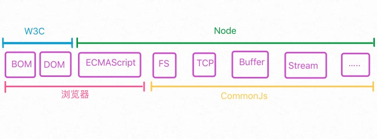

# Node
## 1.Node特点
#### 🍎 擅长处理I/O密集型
  因为Node的异步特性，所以可以同时处理很多事情
  
#### 🍎 不擅长CPU密集事物
  因为Node是单线程，若一个任务长时间占用CPU，会导致后续异步I/O无法发出调用，已完成异步I/O的回调函数也得不到及时执行。
  但其实Node的处理速度挺快的，因为V8的性能很高。
  

## 2.CommonJs
以前对CommonJs没了解过，但是听名字感觉是用来约束js的，但实际恰恰相反，CommonJs是希望JavaScript能够在任何地方运行（因为JS基本都运行在浏览器端，在后端并没有JS的一席之地，所以为了JS能够得到更广泛的应用，出现了CommonJs）

Node在很大程度上受到了CommonJs的影响。

#### 🍎 Node,浏览器，W3C,CommonJs,ECMAScript的关系图如下：

