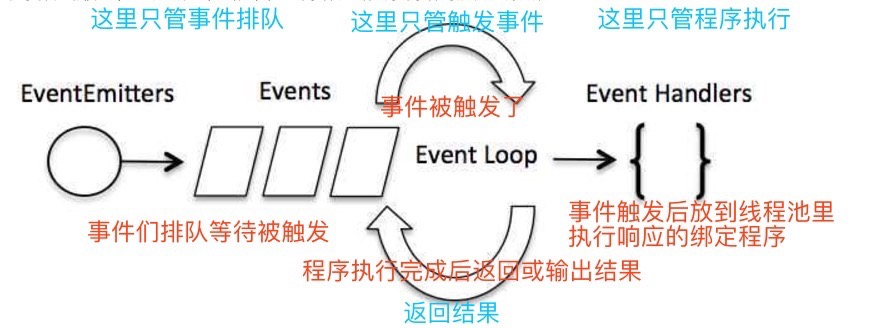

# Node.js 事件循环

虽然node.js是单进程单线程的应用程序，但是他却是利用回调函数进行异步操作，所以支持高并发。这样有非常高的效率，对CPU的利用率也比较高。

node.js的每一个API都是异步的，都是作为一个独立的线程运行。

node.js的事件机制基本都是观察者模式（有点像Vue的计算属性，观察者模式就是一个对象的状态变化后，所有依赖它的对象都会得到通知 并自动进行更新，依赖它的那些对象被称为事件观察者）。
每个异步事件都是一个事件观察者，如果有事件发生就调用它的回调函数。

>## 对进程和线程的理解：
>### 背景知识
>一个程序要执行，首先要准备执行的环境，比如显卡，GPS啊什么的都要准备就位，除了CPU之外的其他的程序的准备构成了程序执行的环境，这个环境叫做上下文。
>CPU执行程序是一个程序一个程序轮流着来的，当CPU执行一个程序时是这样一个过程：CPU加载上下文→→→CPU执行→→→CPU保存上下文。
>CPU保存上下文的目的是为了下一次执行该程序时加载上下文。
>### 进程
>进程是颗粒度较大的程序，当CPU临幸到这个进程的时候，就要加载这个程序的上下文，执行程序，保存这个程序的上下文。
>### 线程
>线程是颗粒度较小的程序，当CPU临幸到这个线程的时候，就要加载这个线程所属进程的上下文，执行程序，保存这个线程所属进程的上下文。
>### 区别
>一个进程是由多个线程组成的，就比如音乐播放器是一个进程G，播放一首歌曲是一个线程a，观看一部MV是一个线程b，创建一个歌单是一个线程c。这些线程a,b,c共同构成了进程G。
>并且线程共享了进程的上下文环境，所以CPU才会加载他所属进程的上下文环境。
>
>参考：<https://www.zhihu.com/question/25532384>

## 事件驱动程序
### 个人理解是这么一个过程：

 * 1.事件处理程序A
 * 2.将事件处理程序A绑定给待触发事件B  eventEmitter.on(B,A)
 * 3.触发事件B   eventEmitter.emit(B)
 * 4.发现事件处理程序A执行了
 
 **所以解释起来是这样：事件`被触发后`驱动`相应的绑定`程序`开始执行`**
 
 代码详见：[vue-and-node-test/src/tryNode/events/events.js](../tryNode/events/events.js)
 
 **如果是许多事件，就是这样：**
 

## node应用程序如何工作？
**原则：在node应用程序中，执行异步操作的函数将回调函数作为最后一个参数，回调函数接受错误对象作为第一个参数。**

代码参考：[vue-and-node-test/src/tryNode/回调函数/nonBloking.js](../tryNode/回调函数/nonBloking.js)

